# 🚀 CloudDeploy — Automated CI/CD Pipeline for Cloud-Native Web Application

[](https://nodejs.org/)
[](https://www.docker.com/)
[](https://aws.amazon.com/codepipeline/)
[](https://aws.amazon.com/codebuild/)
[](https://aws.amazon.com/elasticbeanstalk/)
[](tests/test.js)
[](LICENSE)

---

## 📌 Table of Contents

1. [Project Overview](#-project-overview)
2. [Key Features](#-key-features)
3. [System Architecture & CI/CD Workflow](#-system-architecture--cicd-workflow)
4. [Technology Stack](#-technology-stack)
5. [Project Directory Structure](#-project-directory-structure)
6. [Prerequisites](#-prerequisites)
7. [How to Run the Project Locally](#-how-to-run-the-project-locally)
   - [Method 1: Run with Node.js](#method-1-run-with-nodejs-local-environment)
   - [Method 2: Run with Docker (Recommended)](#method-2-run-with-docker-containerized)
   - [Method 3: Run with Custom Environment Variables](#method-3-run-with-custom-environment-variables)
8. [Automated Testing Suite](#-automated-testing-suite)
9. [Live Examiner / Faculty Demo Guide](#-live-examiner--faculty-demo-guide)
10. [AWS Cloud CI/CD Deployment Setup](#-aws-cloud-cicd-deployment-setup)
11. [API Endpoints Reference](#-api-endpoints-reference)
12. [DevOps Viva & Examination Q&A Reference](#-devops-viva--examination-qa-reference)
13. [License](#-license)

---

## 📖 Project Overview

**CloudDeploy** is an end-to-end, production-grade DevOps project demonstrating a fully **Automated Continuous Integration and Continuous Deployment (CI/CD) Pipeline** for cloud-native web applications.

Whenever a developer commits code to the GitHub repository:
1. **GitHub Webhooks** trigger **AWS CodePipeline**.
2. **AWS CodeBuild** executes an automated pre-build test suite (`tests/test.js`), ensuring code quality and integrity.
3. If all tests pass, CodeBuild packages the application into a lightweight, secure **Docker container** (`node:20-alpine`).
4. The deployment stage automatically rolls out the updated container to **AWS Elastic Beanstalk / AWS App Runner** with zero manual intervention.
5. If any test fails during the build phase, the pipeline **immediately halts**, preventing faulty code from reaching production.

The application includes a **Real-Time DevOps Monitoring Dashboard** with interactive pipeline simulation, live health telemetry, and an integrated Viva Q&A guide.

---

## ✨ Key Features

- **⚡ Fully Automated CI/CD Lifecycle:** Zero-touch deployment workflow triggered automatically upon `git push` to the `main` branch.
- **🛡️ Strict Quality Gate (Fail-Fast CI):** Automated unit, DOM, and system integrity tests run in AWS CodeBuild before image generation.
- **🐳 Enterprise Docker Containerization:**
  - Multi-stage layer caching for fast builds.
  - Alpine Linux base image for minimal attack surface (< 150MB).
  - Unprivileged non-root user (`USER node`) for container security.
  - Native Docker container `HEALTHCHECK` configured.
- **📊 Real-Time DevOps Web Dashboard:**
  - Glassmorphic dark-mode UI with live system metric cards (Uptime, Status, Docker engine, Cloud region).
  - Interactive **CI/CD Pipeline Simulator** with live terminal log streams.
  - Interactive **Health Check Inspector** (`/health` validator).
  - Built-in **Viva & Examination Guide Modal** for viva/demo readiness.
- **☁️ Cloud-Native & Multi-Cloud Ready:** Configured for AWS CodePipeline, AWS CodeBuild, AWS Elastic Beanstalk (`Dockerrun.aws.json`), AWS App Runner, or Amazon ECS.

---

## 🏗️ System Architecture & CI/CD Workflow

```mermaid
flowchart LR
    subgraph Developer["💻 Local Environment"]
        Dev[Developer Workstation]
        Git[Git Commit & Push]
        Dev -->|git push origin main| Git
    end

    subgraph GitHub["🐙 Version Control"]
        Repo[GitHub Repository]
        Webhook[GitHub Webhook Event]
        Git --> Repo
        Repo --> Webhook
    end

    subgraph AWS_CI["⚡ AWS CodePipeline & CodeBuild"]
        Pipeline[AWS CodePipeline]
        CodeBuild[AWS CodeBuild]
        TestSuite["Automated Test Suite\n(tests/test.js)"]
        DockerBuild["Docker Image Build\n(Dockerfile)"]
        
        Webhook -->|Triggers| Pipeline
        Pipeline -->|Runs buildspec.yml| CodeBuild
        CodeBuild -->|Phase 2: pre_build| TestSuite
        TestSuite -->|✔ Tests Pass| DockerBuild
        TestSuite -.->|✖ Tests Fail| Abort["🚨 Pipeline Aborted\n(Bad code blocked)"]
    end

    subgraph AWS_CD["🌐 AWS Cloud Deployment"]
        DeployStage[CodePipeline Deploy Stage]
        AppServer["AWS Elastic Beanstalk / App Runner\n(Container Runtime on Port 8080)"]
        LoadBalancer["Application Load Balancer\n(Health Check: /health)"]
        Users["🌍 End Users & Dashboard"]

        DockerBuild --> DeployStage
        DeployStage --> AppServer
        AppServer --- LoadBalancer
        LoadBalancer --> Users
    end

    classDef pass fill:#10b981,stroke:#059669,stroke-width:2px,color:#fff;
    classDef fail fill:#ef4444,stroke:#dc2626,stroke-width:2px,color:#fff;
    classDef cloud fill:#0284c7,stroke:#0369a1,stroke-width:2px,color:#fff;
    class AppServer,Users cloud;
    class TestSuite,DockerBuild pass;
    class Abort fail;
```



### CI/CD Pipeline Stages Breakdown

| Stage | Phase / Tool | Configuration File | Description |
|---|---|---|---|
| **1. Source** | GitHub Repository | `.gitignore` | Emits webhook on push to `main` branch to trigger AWS CodePipeline. |
| **2. Install** | AWS CodeBuild | `buildspec.yml` | Sets up Node.js 20 environment and installs project dependencies (`npm install`). |
| **3. Pre-Build (Test)** | Automated Test Suite | `tests/test.js` | Executes integration, endpoint, and file integrity tests (`npm test`). |
| **4. Build (Package)** | Docker Engine | `Dockerfile` | Builds and tags standardized container image (`clouddeploy-app:latest`). |
| **5. Post-Build** | Artifact Packaging | `buildspec.yml` | Prepares deployment descriptors (`Dockerrun.aws.json`) and source bundle. |
| **6. Deploy** | AWS Elastic Beanstalk | `Dockerrun.aws.json` | Deploys container to live production environment with zero downtime. |

---

## 💻 Technology Stack

- **Backend / Web Server:** Node.js (v20 LTS), Express.js (v4.x)
- **Frontend Dashboard:** Semantic HTML5, Vanilla CSS3 (Custom Glassmorphism design system), Vanilla JavaScript (ES6+)
- **Containerization:** Docker (Alpine Linux `node:20-alpine`)
- **CI/CD Orchestration:** AWS CodePipeline, GitHub Webhooks
- **Build & Test Automation:** AWS CodeBuild, `buildspec.yml`, Node.js Assertion Suite
- **Cloud Hosting Platform:** AWS Elastic Beanstalk (Docker Platform) / AWS App Runner / Amazon ECS
- **Configuration & Orchestration:** `Dockerrun.aws.json`, `Dockerfile`, `.dockerignore`

---

## 📁 Project Directory Structure

```text
Automated CICD Pipeline for Cloud/
├── app/                           # Frontend Dashboard Source Code
│   ├── index.html                 # Main DevOps Dashboard UI & Viva Modal
│   ├── script.js                  # Real-time polling, simulation & UI logic
│   └── style.css                  # Modern dark-mode & glassmorphic styling
├── tests/                         # Automated Testing Suite
│   └── test.js                    # Unit, DOM, API status & file integrity tests
├── .dockerignore                  # Files excluded from Docker container context
├── .gitignore                     # Files excluded from Git version control
├── buildspec.yml                  # AWS CodeBuild 4-phase build lifecycle configuration
├── Dockerfile                     # Docker container specification (Node 20 Alpine)
├── Dockerrun.aws.json             # AWS Elastic Beanstalk container deployment descriptor
├── package.json                   # Node.js manifest, dependencies & scripts
├── package-lock.json              # Locked dependency tree
├── server.js                      # Express.js HTTP web server & API routes
└── README.md                      # Comprehensive project documentation
```

---

## ⚙️ Prerequisites

Before running the project, make sure you have the following installed on your machine:

1. **Node.js**: `v18.x` or `v20.x` LTS ([Download Node.js](https://nodejs.org/))
2. **NPM**: `v9.x` or `v10.x` (bundled with Node.js)
3. **Docker Desktop**: (Optional, for containerized run) ([Download Docker Desktop](https://www.docker.com/products/docker-desktop/))
4. **Git**: ([Download Git](https://git-scm.com/))

Verify installations:
```bash
node -v
npm -v
docker -v
git --version
```

---

## 🚀 How to Run the Project Locally

### Method 1: Run with Node.js (Local Environment)

#### 1. Clone the repository (or navigate to project folder)
```bash
cd "Automated CICD Pipeline for Cloud"
```

#### 2. Install dependencies
```bash
npm install
```

#### 3. Run the automated test suite
```bash
npm test
```
*Expected Output: `Passed: 4 | Failed: 0` → `🎉 BUILD SUCCESS: All automated tests passed.`*

#### 4. Start the application server
```bash
npm start
```
*Or run in development mode:*
```bash
npm run dev
```

#### 5. Access the Dashboard
Open your web browser and navigate to:
```text
http://localhost:8080
```

- **Health Check Endpoint:** [http://localhost:8080/health](http://localhost:8080/health)
- **API Status Endpoint:** [http://localhost:8080/api/status](http://localhost:8080/api/status)

---

### Method 2: Run with Docker (Containerized)

To simulate the exact production container environment built by AWS CodeBuild:

#### 1. Build the Docker Image
```bash
docker build -t clouddeploy-app:latest .
```

#### 2. Run the Docker Container
```bash
docker run -d -p 8080:8080 --name clouddeploy-container clouddeploy-app:latest
```

#### 3. Verify Container Status & Logs
```bash
# Check running containers and health status
docker ps

# View live container logs
docker logs -f clouddeploy-container
```

#### 4. Test Container Healthcheck
```bash
docker inspect --format='{{json .State.Health.Status}}' clouddeploy-container
```
*Output: `"healthy"`*

#### 5. Open in Browser
Visit [http://localhost:8080](http://localhost:8080) to interact with the containerized application.

#### 6. Stop and Remove Container
When done testing:
```bash
docker stop clouddeploy-container
docker rm clouddeploy-container
```

---

### Method 3: Run with Custom Environment Variables

You can customize the listening port, application version, and environment label:

**On Linux / macOS / Git Bash:**
```bash
PORT=3000 APP_VERSION=v1.1.0 ENVIRONMENT="Staging (Local)" npm start
```

**On Windows PowerShell:**
```powershell
$env:PORT="3000"; $env:APP_VERSION="v1.1.0"; $env:ENVIRONMENT="Staging (Local)"; npm start
```

---

## 🧪 Automated Testing Suite

The project includes an automated test suite located at `tests/test.js`. In an enterprise CI/CD pipeline, tests act as a mandatory quality gate.

```bash
npm test
```

### What `tests/test.js` Validates:

1. **`GET /health` Endpoint Verification:** Ensures the server returns HTTP 200, valid JSON schema, `status: healthy`, correct version format (`v*`), and numeric uptime.
2. **Dashboard UI Integrity (`GET /`):** Verifies that the HTML page renders correctly with all required DOM elements and action buttons.
3. **DevOps Telemetry API (`GET /api/status`):** Ensures application status is `ONLINE`, pipeline status is `SUCCESS`, and Docker metadata is present.
4. **File System Integrity Check:** Ensures critical project files (`Dockerfile`, `buildspec.yml`, `app/index.html`, `app/style.css`, `app/script.js`) exist.

---

## 🎯 Live Examiner / Faculty Demo Guide

Use this 3-step live demonstration during your project examination or viva to showcase the CI/CD pipeline in action:

### Demo Scenario 1: The "Green Pipeline" (Successful Auto-Deployment)
1. Edit `package.json` and `server.js` to increment the version from `v1.0.0` to `v1.0.1`.
2. Commit and push:
   ```bash
   git commit -am "chore: bump version to v1.0.1"
   git push origin main
   ```
3. Show the examiner **AWS CodePipeline**:
   - Source stage automatically pulls new commit from GitHub.
   - CodeBuild runs `npm test` and builds the Docker image.
   - Deploy stage deploys the new container version to Elastic Beanstalk with zero downtime.

### Demo Scenario 2: The "Red Pipeline" (Automated Failure Rejection)
1. Open `tests/test.js` and uncomment the intentional failure hook (Line 171):
   ```javascript
   throw new Error("DEMO ERROR: Intentional failure to test AWS CodeBuild rejection!");
   ```
2. Commit and push:
   ```bash
   git commit -am "test: trigger intentional test failure"
   git push origin main
   ```
3. Show the examiner **AWS CodePipeline**:
   - AWS CodeBuild detects test failure during `pre_build`.
   - The build status changes to `FAILED`.
   - CodePipeline **halts immediately**. The live production application remains untouched and stable.

### Demo Scenario 3: Pipeline Self-Healing & Recovery
1. Re-comment the intentional failure line in `tests/test.js`.
2. Commit and push:
   ```bash
   git commit -am "fix: restore passing test suite"
   git push origin main
   ```
3. CodePipeline re-triggers, runs clean tests, passes the build, and deploys successfully.

---

## ☁️ AWS Cloud CI/CD Deployment Setup

Follow these steps to deploy this repository on AWS using **AWS CodePipeline**, **AWS CodeBuild**, and **AWS Elastic Beanstalk**:

### Step 1: Push Project to GitHub
```bash
git init
git add .
git commit -m "Initial commit: CloudDeploy CI/CD Project"
git branch -M main
git remote add origin https://github.com/<your-username>/<your-repo-name>.git
git push -u origin main
```

### Step 2: Create AWS Elastic Beanstalk Application
1. Log in to the **AWS Management Console**.
2. Navigate to **Elastic Beanstalk** → **Create application**.
3. Application name: `clouddeploy-app`.
4. Platform: **Docker** (Managed platform).
5. Platform branch: **Docker running on 64bit Amazon Linux 2023**.
6. Application code: Select **Sample application** (CodePipeline will overwrite this).
7. Click **Create Application**.

### Step 3: Create AWS CodeBuild Project
1. Navigate to **AWS CodeBuild** → **Create build project**.
2. Project name: `clouddeploy-build`.
3. Source provider: **GitHub** (Authorize with GitHub and select your repository).
4. Environment:
   - Environment image: **Managed image**
   - Operating system: **Amazon Linux 2**
   - Runtime(s): **Standard**
   - Image: `aws/codebuild/amazonlinux2-x86_64-standard:5.0`
   - Privileged: **Check "Enable this flag if you want to build Docker images"**
5. Buildspec: Select **Use a buildspec file** (it automatically reads `buildspec.yml`).
6. Click **Create build project**.

### Step 4: Create AWS CodePipeline
1. Navigate to **AWS CodePipeline** → **Create pipeline**.
2. Pipeline name: `clouddeploy-pipeline`.
3. **Source Stage:**
   - Source provider: **GitHub (Version 2)**
   - Connection: Connect your GitHub account
   - Repository: `<your-username>/<your-repo-name>`
   - Branch: `main`
   - Trigger: **Push to branch**
4. **Build Stage:**
   - Build provider: **AWS CodeBuild**
   - Project name: `clouddeploy-build`
5. **Deploy Stage:**
   - Deploy provider: **AWS Elastic Beanstalk**
   - Application name: `clouddeploy-app`
   - Environment name: Select your created environment (e.g., `Clouddeploy-app-env`)
6. Review and click **Create pipeline**.

### Step 5: Verify Deployment
- AWS CodePipeline will automatically fetch the source, run tests via CodeBuild, and deploy to Elastic Beanstalk.
- Click the Elastic Beanstalk environment URL to view your live public cloud deployment!

---

## 📡 API Endpoints Reference

| Method | Endpoint | Description | Sample Response |
|---|---|---|---|
| `GET` | `/` | Web Application Dashboard UI | HTML Document (`index.html`) |
| `GET` | `/health` | Health Check for Load Balancers & Monitoring | `{"status":"healthy","service":"CloudDeploy","version":"v1.0.0","uptime_seconds":120,"http_code":200}` |
| `GET` | `/api/status` | Real-time DevOps Pipeline & Container Telemetry | `{"application":{...},"pipeline":{...},"docker":{...},"system":{...}}` |

---

## 📚 DevOps Viva & Examination Q&A Reference

<details>
<summary><strong>Click to expand 10 Essential Viva Questions & Answers</strong></summary>

<br>

#### Q1: What is the difference between Continuous Integration (CI) and Continuous Deployment (CD)?
> **CI (Continuous Integration):** The automated process of merging developer code changes into a central repository, followed by automated building and testing to detect integration bugs early.  
> **CD (Continuous Deployment):** The automated process where every validated change that passes the CI build is automatically deployed directly to production with zero manual intervention.

#### Q2: What is the role of `buildspec.yml` in AWS CodeBuild?
> `buildspec.yml` is a YAML configuration file consumed by AWS CodeBuild that defines the commands, runtime environments, phases (`install`, `pre_build`, `build`, `post_build`), and output artifacts needed during the automated build lifecycle.

#### Q3: Why is automated testing placed in the `pre_build` phase?
> Putting tests in `pre_build` implements the **fail-fast** principle. If any test fails, the process exits with a non-zero status code, CodeBuild fails, and CodePipeline stops before expensive Docker builds and deployments take place.

#### Q4: Why do we containerize our web application with Docker?
> Docker encapsulates the application code, Node.js runtime, dependencies, and OS configurations into an immutable, portable artifact. This eliminates environment drift ("works on my machine" issues) and ensures identical behavior across local and cloud environments.

#### Q5: What security best practices are implemented in the `Dockerfile`?
> 1. Uses a minimal base image (`node:20-alpine`) to reduce vulnerability surface area.
> 2. Leverages Docker layer caching (`COPY package*.json ./` before `COPY . .`).
> 3. Switches to an unprivileged non-root user (`USER node`) instead of running as `root`.
> 4. Configures a built-in container `HEALTHCHECK`.

#### Q6: What is the purpose of `Dockerrun.aws.json`?
> `Dockerrun.aws.json` is an Elastic Beanstalk configuration file that instructs the AWS Docker container manager on which container port to map (port 8080) and where to route container logging.

#### Q7: How does GitHub communicate with AWS CodePipeline?
> Through AWS CodeStar Source Connections or Webhooks. When a `git push` event occurs on the `main` branch, GitHub sends an HTTPS webhook event to AWS, triggering the pipeline automatically.

#### Q8: What is a Health Check endpoint and why is it necessary?
> A health check endpoint (such as `GET /health`) allows AWS Application Load Balancers and orchestration tools to continuously monitor container liveness. If a container stops responding with HTTP 200, the load balancer stops routing traffic to it and launches a fresh instance.

#### Q9: What is Blue/Green Deployment?
> A zero-downtime deployment strategy where two identical environments exist (Blue = current live, Green = new version). Traffic is shifted to Green only after it passes health checks. If an error occurs, traffic instantly rolls back to Blue.

#### Q10: What is the significance of `.dockerignore` and `.gitignore`?
> - `.gitignore` prevents secret files, `.env`, and bloated folders (`node_modules/`) from being committed to source control.
> - `.dockerignore` prevents unnecessary local files and host dependencies from being copied into the Docker build context, resulting in faster builds and smaller images.

</details>

---

## 📄 License

This project is licensed under the **MIT License** — see the [package.json](package.json) file for details.

---

### 👨‍💻 Author & Acknowledgements
- **Project:** Automated CI/CD Pipeline for Cloud-Native Web Application Deployment
- **Topic:** DevOps, Cloud Computing, Docker & AWS Automation
- **Target Audience:** Engineering Students, DevOps Enthusiasts, Cloud Developers

*⭐ If this project helped you understand CI/CD, consider giving this repository a star!*
# Automated-CI-CD-Pipeline-for-Cloud

